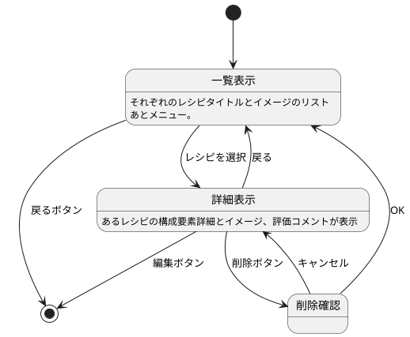

# B2 レシピノート（Recipe Note）

## 概要
プレイヤーが既存レシピを確認したり、新しいレシピを作成・保存するためのシーン。
ラーメン屋のメモ帳をイメージにデザインする

## 機能一覧

| 項目              | 内容                                               |
|-------------------|----------------------------------------------------|
| レシピ一覧表示    | 保存済みレシピをリスト形式で表示 |
| レシピ詳細表示    | 保存済みレシピの詳細を表示 |
| レシピ作成ボタン  | 新規作成シーン（B2-1 素材選択）へ遷移             |
| レシピ編集        | 既存レシピを選択して再編集可能                     |
| レシピ削除        | レシピ単位で削除操作が可能                         |

## UI要素

- レシピ一覧はノートの目次っぽく表現する
- レシピ名をタップすると詳細へ。
- 詳細には各構成要素とイメージ、そして評価テキストがある
- 削除と編集も詳細から
- 新しく作るのはレシピ一覧の一番下に。タップすると B3 レシピ作成シーンへ
- 戻る（A2へ）

## 遷移元・遷移先

- 遷移元：A2 ダッシュボード
- 遷移先：
  - B2-1：素材選択シーン（レシピクラフト）
  - B2-1：素材選択シーン（レシピクラフト）
  - B2-2：レシピ詳細ビュー（任意）



## API 呼び出し

```
@startuml
actor Player
participant UI as "B2 レシピノート"
participant API as "レシピ一覧取得API"
database DB as "サーバDB"

Player -> UI : シーンに遷移
activate UI

UI -> API : GET /recipes
activate API

API -> DB : レシピ一覧をクエリ
DB --> API : データ返却
API --> UI : レシピ一覧データ（JSON）

UI -> UI : レシピ一覧を描画
deactivate API
deactivate UI
@enduml
```

## 備考

- レシピは最大50個まで保存可能（予定）
- 一部のレシピはNPCから入手、編集不可（創作ヒント用途）
